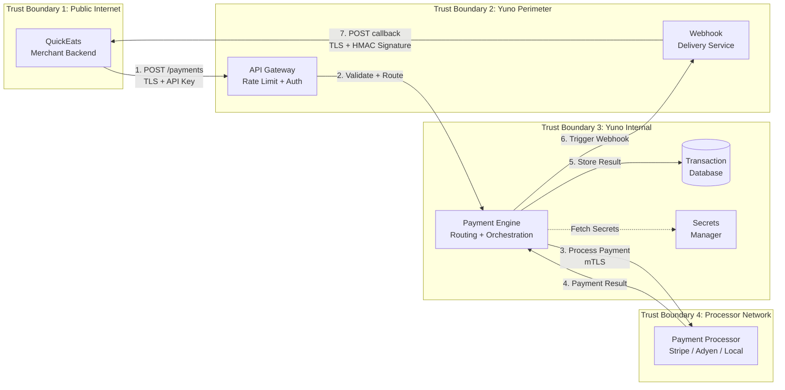
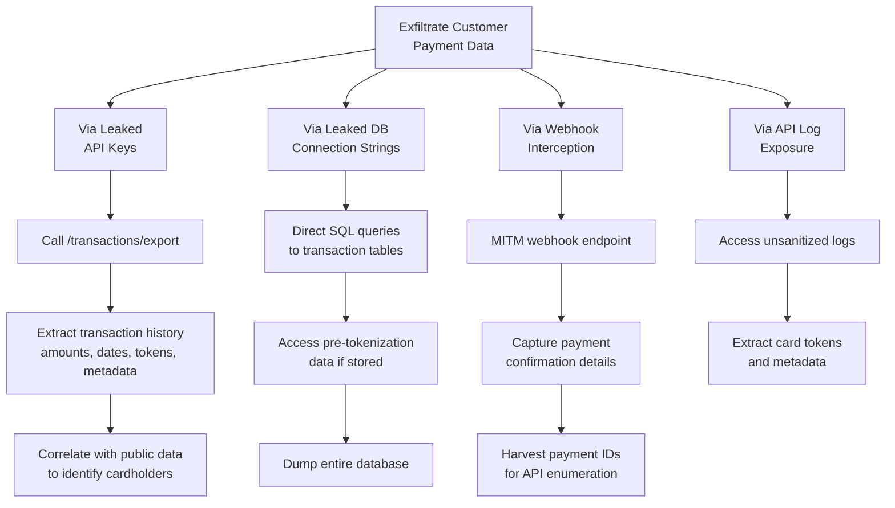
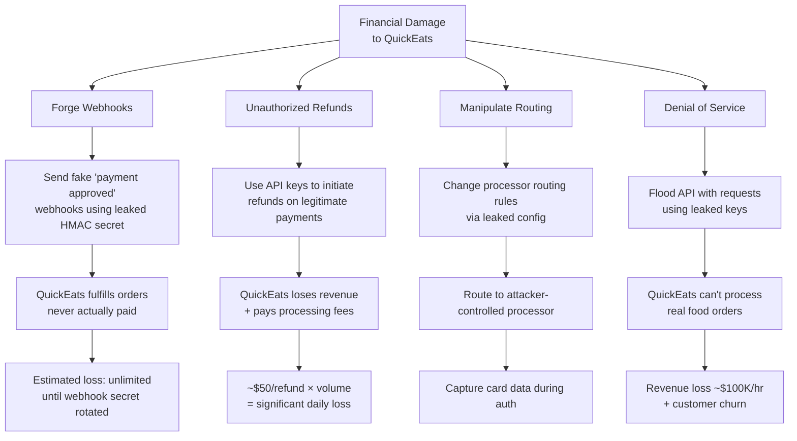

# Threat Model & Security Design Analysis

## 1. Executive Summary

This document presents a structured threat analysis of Yuno's merchant API and webhook architecture, triggered by the QuickEats credential leak incident. We apply the STRIDE framework to identify threats, quantify impact, map existing controls, and recommend additional mitigations. The analysis covers the full payment flow from merchant API request through payment processing to webhook callback.

**Key finding:** The QuickEats incident exposed fundamental weaknesses in merchant credential management that affect all 1,000+ Yuno integrations. The highest-priority mitigations are: short-lived tokens (replacing long-lived API keys), mandatory secrets scanning, and webhook signature migration from shared-secret HMAC to asymmetric signatures.

---

## 2. System Context & Data Flow

### Trust Boundaries

| Boundary | Crossing | Protocol | Threats |
|----------|----------|----------|---------|
| TB1: Merchant ↔ Yuno API | Public internet | TLS 1.2+ | MITM, credential theft, replay |
| TB2: API Gateway ↔ Payment Engine | Internal network | mTLS | Lateral movement, insider threat |
| TB3: Yuno ↔ Payment Processors | Partner network | TLS + API auth | Processor compromise, routing manipulation |
| TB4: Yuno → Merchant (webhook) | Public internet | TLS + HMAC | Webhook forgery, replay, interception |

---

## 3. Threat Actor Profiles

| Actor | Motivation | Capability | Likely Actions | Estimated Probability |
|-------|-----------|------------|----------------|----------------------|
| **Opportunistic Scraper** | Financial gain, credential resale | Low-Medium: automated GitHub scanning, basic API knowledge, scripts | Sell credentials on dark web; attempt bulk data export; try automated refund fraud | High (GitHub scrapers are automated and pervasive) |
| **Targeted Attacker** (competitor or fraud ring) | Disrupt QuickEats business, steal customer data | Medium-High: payment domain expertise, can craft sophisticated API calls, understands routing | Manipulate payment routing to cause declines; forge webhooks to mark fraudulent orders as "paid"; exfiltrate transaction data for card-not-present fraud | Medium |
| **Malicious Insider** (QuickEats employee) | Financial gain, grudge, coercion | High: knows the codebase, has context on business logic, has legitimate access | Intentional credential leak for plausible deniability; create backdoor API keys; gradually exfiltrate customer data; sell transaction metadata | Low-Medium |

---

## 4. STRIDE Threat Analysis

| # | Component | STRIDE | Threat | Impact | Likelihood | Risk | Current Controls | Recommended Controls |
|---|-----------|--------|--------|--------|-----------|------|-----------------|---------------------|
| T1 | API Authentication | **S**poofing | Attacker uses leaked API keys to impersonate QuickEats | **CRITICAL**: Full API access — read/write payments, initiate refunds. $2.5M/day at risk | HIGH | **CRITICAL** | API key auth, rate limiting | Short-lived OAuth2 tokens, IP allowlisting, anomaly detection |
| T2 | Webhook Delivery | **T**ampering | Attacker forges webhooks with leaked HMAC secret | **CRITICAL**: Mark unpaid orders as "paid" → financial loss + inventory fraud | HIGH | **CRITICAL** | HMAC-SHA256 signing | Timestamp validation, nonce dedup, dual-key rotation, asymmetric signatures |
| T3 | API Logging | **I**nformation Disclosure | Logs contain tokenized card data or correlation metadata | **HIGH**: Token + metadata (amount, timestamp, merchant) enables correlation attacks | MEDIUM | **HIGH** | Basic log sanitization | PAN masking, structured SIEM logging, log access controls, retention per PCI-DSS 10.7 |
| T4 | Payment Routing | **T**ampering | Attacker modifies routing rules to redirect payments | **CRITICAL**: Financial loss, card data diverted to attacker-controlled "processor" | LOW | **HIGH** | Admin-only access | MFA for routing changes, immutable audit log, approval workflow |
| T5 | Credential Storage | **I**nformation Disclosure | Secrets hardcoded in source code committed to VCS | **CRITICAL**: Exactly what happened — full credential exposure to the internet | HIGH | **CRITICAL** | .gitignore | Secrets manager, pre-commit scanning, CI/CD detection, developer training |
| T6 | Webhook Replay | **S**poofing | Attacker captures valid webhook and replays it | **HIGH**: Duplicate payment confirmations → fulfillment fraud, inventory manipulation | MEDIUM | **HIGH** | None | Timestamp validation (5-min window) + nonce/idempotency dedup |
| T7 | API Rate Limiting | **D**enial of Service | Attacker floods API with requests using leaked keys | **MEDIUM**: Service degradation, potential cascade to other merchants on shared infra | MEDIUM | **MEDIUM** | Basic rate limiting | Per-merchant token bucket, auto-suspend on abuse, WAF behavioral analysis |
| T8 | Database Access | **I**nformation Disclosure | Attacker uses leaked DB connection strings | **CRITICAL**: Bypass ALL API controls, direct access to transaction tables, potential PAN exposure pre-tokenization | HIGH | **CRITICAL** | Network segmentation | Immediate password rotation, IAM-based DB auth, VPC-only access, DB audit logging |
| T9 | Transaction Export | **I**nformation Disclosure | Bulk data exfiltration via /transactions/export | **HIGH**: Full transaction history — amounts, dates, tokenized cards, customer metadata | HIGH | **CRITICAL** | API authentication | Scoped keys (least privilege), export rate limits, additional MFA for bulk exports |
| T10 | Key Rotation Window | **S**poofing | During rotation, both old and new keys valid simultaneously | **MEDIUM**: Extended validity window if old key not promptly revoked | LOW | **MEDIUM** | None | Bounded transition window (max 1h), deprecation warnings, monitoring for old-key usage |
| T11 | API Key Management Endpoint | **E**levation of Privilege | Attacker uses leaked keys to call /api-keys and create NEW backdoor keys before rotation completes | **CRITICAL**: Persistent access that survives credential rotation — attacker retains access even after incident response | MEDIUM | **CRITICAL** | API authentication | Disable key-creation endpoints during incident, audit all keys created in exposure window, require MFA for key management |
| T12 | Merchant Dependency Supply Chain | **T**ampering | Compromised npm/pip dependency in merchant's stack intercepts secrets at runtime (e.g., malicious middleware reads YUNO_API_KEY from env) | **CRITICAL**: Silent, persistent credential theft undetectable by secrets scanning — bypasses all pre-commit/CI controls | LOW | **HIGH** | None | SCA scanning (Dependabot, Snyk), dependency pinning with lockfiles, runtime secrets isolation via dedicated sidecar |

---

## 5. Attack Trees

### Attack Tree 1: Exfiltrate Customer Payment Data

### Attack Tree 2: Cause Financial Loss to QuickEats

---

## 6. Design Decisions & Rationale

### 6.1 Webhook Authentication: HMAC-SHA256

**Chosen:** HMAC-SHA256 with timestamp-prefixed message

| Alternative | Pros | Cons | Why Rejected |
|-------------|------|------|-------------|
| **JWT (JSON Web Tokens)** | Familiar, self-contained claims | Parsing complexity, `alg:none` vuln history, overkill for unidirectional webhooks | Adds failure modes without benefit for webhook use case |
| **RSA/ECDSA signatures** | No shared secret (asymmetric) — limits leak blast radius | 10x slower signing, more complex key management, larger signatures | Worth evaluating for v2; currently overkill given rotation support |
| **mTLS** | Strongest mutual auth | Requires merchant to manage TLS certs — too complex for small teams (QuickEats: 8 devs) | Operational burden disproportionate to threat model for most merchants |

**Quantified tradeoff:** HMAC-SHA256 adds ~0.01ms per verification. RSA-2048 would add ~0.5ms. At 50K webhooks/day, the difference is negligible (0.5s vs 25s total). However, HMAC shared secret is the simpler integration for merchants.

**Recommendation for future:** Migrate to Ed25519 asymmetric signatures. Yuno holds private key, distributes public key to merchants. Eliminates shared secret risk entirely. Estimated migration effort: 2 sprints.

### 6.2 Secrets Management: Abstraction Layer

**Chosen:** Backend-agnostic interface (EnvironmentBackend for dev, AWSSecretsManagerBackend / VaultBackend for production)

**Why not just environment variables:** Env vars don't rotate at runtime, don't audit access, and persist in process memory indefinitely. Fine for development, insufficient for production per PCI-DSS Req 3.5 (protect cryptographic keys used for cardholder data encryption).

**Why not Vault-only:** Lock-in concern. Not all merchants (1,000+) have Vault infrastructure. The abstraction lets merchants choose based on their maturity:
- Small teams (like QuickEats): start with env vars + dotenv
- Medium teams: AWS Secrets Manager (managed, low ops overhead)
- Enterprise: HashiCorp Vault (full audit trail, dynamic secrets)

**Quantified tradeoff:** AWS SM adds ~50ms per secret fetch (mitigated by 5-min TTL cache → amortized to ~0ms for steady-state). Vault adds ~5ms (faster, self-hosted). Env vars: 0ms. Payment processing latency is ~200-500ms, so even uncached SM calls add < 25% overhead.

### 6.3 Rate Limiting: Token Bucket Algorithm

**Chosen:** Token bucket with per-key + per-IP + per-endpoint dimensions

| Alternative | Pros | Cons | Why Rejected |
|-------------|------|------|-------------|
| **Fixed window** | Simplest to implement | Allows 2x burst at window boundary | Burst at boundary can cause cascading failures |
| **Sliding window log** | Most accurate | Stores every request timestamp — memory-intensive at 1,000+ merchants | O(n) memory per merchant, doesn't scale |
| **Leaky bucket** | Smooths output perfectly | No legitimate bursts allowed | QuickEats has spiky traffic (lunch/dinner rush) — would throttle legitimate peaks |

**Why per-merchant AND per-IP:** Per-merchant limits total usage. Per-IP detects credential sharing (multiple parties using same key from different IPs, which is a security signal and TOS violation).

### 6.4 Replay Protection: Timestamp + Nonce

**Why both, not just timestamp:** Timestamp alone with 5-min tolerance allows replay within that window. A 5-min window is necessary for clock skew (especially with merchant servers in different time zones). Nonce deduplication closes the gap: any webhook with a previously-seen idempotency key is rejected, even within the timestamp window.

**Why not just nonce:** Nonce-only requires permanent storage of all seen nonces. With timestamp, we only need to store nonces for the tolerance window (5 min TTL). At 50K webhooks/day: ~174 active nonces at any time, ~1KB each = 174KB. Trivial even in-memory; use Redis SETEX for distributed deployments.

### 6.5 Error Responses: Generic by Design

**Chosen:** All webhook verification failures return `{"error": "invalid_webhook"}` regardless of which check failed.

**Why:** Differentiated errors (e.g., "timestamp expired", "invalid signature", "duplicate nonce") allow attackers to systematically bypass controls. If they know the signature check passed but timestamp failed, they focus on timestamp manipulation. Generic errors force attackers to solve all problems simultaneously — exponentially harder.

**Tradeoff:** Harder to debug for legitimate merchants. Mitigation: detailed logging server-side (only accessible to Yuno ops), plus merchant-facing debug endpoint that works only with test keys.

---

## 7. Compliance Mapping

| Requirement | PCI-DSS Reference | Implementation | Status |
|-------------|-------------------|----------------|--------|
| Protect stored cardholder data | Req 3.4 | Yuno tokenizes PANs; merchant never receives raw card numbers; logs mask to BIN+last4 | Implemented |
| Encrypt cardholder data in transit | Req 4.1 | TLS 1.2+ enforced; HSTS headers; certificate validation | Implemented |
| Restrict access on need-to-know | Req 7.1 | Scoped API keys: PAYMENT_READ, PAYMENT_WRITE, REFUND_WRITE, etc. | Implemented |
| Unique IDs for all access | Req 8.1 | X-Request-Id on every request, tied to merchant + API key | Implemented |
| Track and monitor all access | Req 10.2 | Structured audit logging; sanitized; shipped to SIEM | Implemented |
| Log retention | Req 10.7 | Minimum 1 year retention, 3 months immediately accessible | Architecture (SIEM config) |
| Regularly test security | Req 11.3 | Automated secrets scanning in CI/CD; unit tests for security controls | Implemented |
| Incident response plan | Req 12.10 | This playbook + automation scripts | Implemented |
| Protect cryptographic keys | Req 3.5 | Secrets Manager abstraction; never hardcoded; audit-logged access | Implemented |
| Secure coding practices | Req 6.5 | HMAC constant-time comparison, input validation, error sanitization | Implemented |

**OWASP API Security Top 10 alignment:**

| OWASP Code | Risk | Our Mitigation |
|------------|------|---------------|
| API1:2023 | Broken Object Level Authorization | Payment ID validation + scoped keys |
| API2:2023 | Broken Authentication | API keys in headers (not URL), request signing, TLS enforcement |
| API3:2023 | Broken Object Property Level Authorization | Generic error responses, no internal state leakage |
| API4:2023 | Unrestricted Resource Consumption | Token bucket rate limiting at 3 dimensions |
| API5:2023 | Broken Function Level Authorization | Scope-based access control with @requires_scope decorator |
| API8:2023 | Security Misconfiguration | Fail-fast config validation, restrictive CORS, security headers |

---

## 8. Residual Risks & Future Work

| # | Risk | Current Mitigation | Gap | Effort | Priority |
|---|------|-------------------|-----|--------|----------|
| R1 | Long-lived API keys with no auto-expiration | 90-day rotation policy (manual) | Relies on merchant compliance; keys valid indefinitely if not rotated | Large (OAuth2 implementation) | **P1** |
| R2 | HMAC shared secret can be leaked | Rotation support, dual-key verification | Both parties hold the secret; any leak compromises webhooks | Medium (asymmetric sig migration) | **P1** |
| R3 | In-memory nonce store not distributed | Works for single-instance | Loses state on restart; not shared across instances | Small (Redis migration) | **P2** |
| R4 | Merchant credential hygiene unenforceable | Documentation, training | Can't prevent merchants from hardcoding secrets | Medium (automated scanning of public repos) | **P1** |
| R5 | Rate limiting bypass via distributed IPs | Per-IP + per-key limits | Attacker with botnet can distribute across many IPs | Medium (WAF behavioral analysis) | **P2** |
| R6 | No mutual TLS for webhooks | HMAC signature | HMAC verifies sender, but doesn't authenticate the receiver endpoint | Medium (mTLS or asymmetric sigs) | **P2** |
| R7 | Processor credential rotation coordination | Manual process | Requires synchronized rotation with each processor | Large (processor API integration) | **P3** |

---

## 9. Recommendations Priority Matrix

| # | Recommendation | Impact | Effort | Priority | Owner | Timeline |
|---|---------------|--------|--------|----------|-------|----------|
| 1 | **Mandatory secrets scanning** for all merchant integrations | Prevents future leaks | S-M | P1 | Yuno Platform | 2 weeks |
| 2 | **Short-lived OAuth2 tokens** replacing API keys | Limits blast radius of any leak to token lifetime (30 min) | L | P1 | Yuno Auth | 2 sprints |
| 3 | **IP allowlisting as default** for production merchants | Blocks unauthorized API access from unknown networks | S | P1 | Yuno API GW | 1 week |
| 4 | **Automated GitHub scanning** for Yuno credential patterns across all public repos | Early detection of future leaks | S | P1 | Yuno Security | 1 week |
| 5 | **Asymmetric webhook signatures** (Ed25519) replacing HMAC shared secret | Eliminates shared secret risk for webhooks entirely | M | P2 | Yuno Webhook | 2 sprints |
| 6 | **Merchant security scoring dashboard** | Proactive risk identification across 1,000+ merchants | M-L | P2 | Yuno Security | 1 quarter |
| 7 | **Redis-backed nonce deduplication** | Distributed replay protection across all instances | S | P3 | Yuno Webhook | 3 days |
| 8 | **Automated credential rotation reminders** | Reduce stale credential exposure window | S | P2 | Yuno Platform | 1 week |
